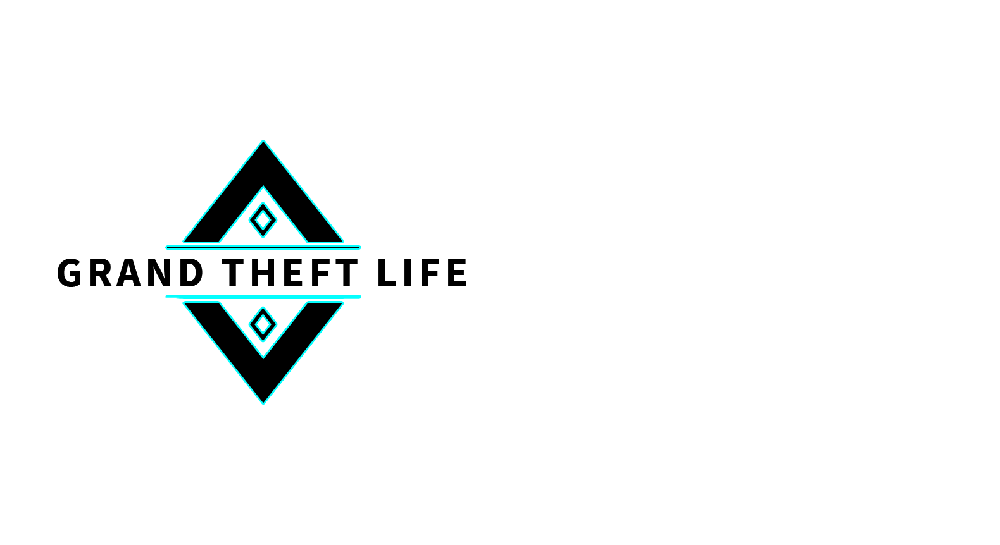

### Hi there 👋
<!--
**Manon04/Manon04** is a ✨ _special_ ✨ repository because its `README.md` (this file) appears on your GitHub profile.

Here are some ideas to get you started:

- 🔭 I’m currently working on ...
- 🌱 I’m currently learning ...
- 👯 I’m looking to collaborate on ...
- 🤔 I’m looking for help with ...
- 💬 Ask me about ...
- 📫 How to reach me: ...
- 😄 Pronouns: ...
- ⚡ Fun fact: ...
-->

# 😏Manon Ballatore😏 
*📧ballatoremanon@gmail.com📧*
<!--Photo-->
 

<!--Tableau-->
| Tables        | Are           | Cool  |
| ------------- |:-------------:| -----:|
| col 3 is      | right-aligned | $1600 |
| col 2 is      | centered      |   $12 |
| zebra stripes | are neat      |    $1 |

Texte normal suivi d’un [color=#26B260]texte coloré en vert[/color] dans un paragraphe.
<!--Citation-->
> Oh la belle prise !
<!--couleur-->
une élément
* un autre
 * un sous élément
 * un autre sous élément
* un dernier élément

1. élément un
2. élément deux

# Un grand titre
## Un titre un peu moins grand
### Un titre encore moins grand

Aidez-vous avec [la documentation de Framasite](https://docs.framasoft.org/fr/grav/) !